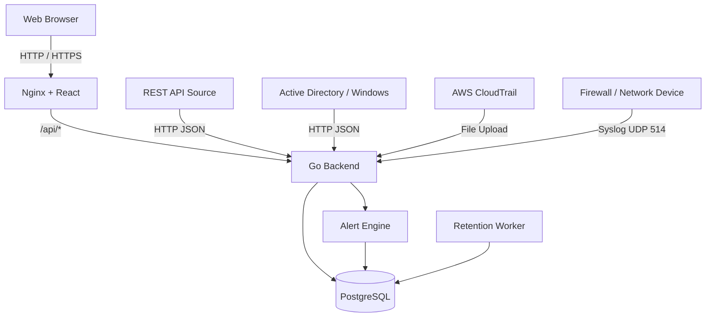

# Demo Log Management System

A multi-source Log Management System built with React, Go, PostgreSQL, and Docker.

The system collects logs from multiple sources, normalizes them into a common schema, stores them in PostgreSQL, and provides log search, dashboards, alerts, authentication, tenant isolation, and automatic log retention.

The project supports two deployment modes:

- **Appliance** — single machine or VM using Docker Compose
- **SaaS** — Google Cloud deployment with HTTPS

---

## Features

### Log Sources

The demo supports four ingestible log sources:

| Source | Ingestion Method |
|---|---|
| REST API | HTTP JSON |
| Firewall / Network Device | Syslog UDP |
| Active Directory / Windows | HTTP JSON |
| AWS CloudTrail | File Batch Upload |

### Log Management

- Common normalized log schema
- PostgreSQL storage
- Text search
- Tenant filter
- Source filter
- Event type filter
- User filter
- Time-range filter

### Dashboard

- Total logs
- Timeline
- Top source IPs
- Top users
- Top event types
- Tenant filtering

### Alerting

Current demo rule:

**Repeated Failed Login**

An alert is generated when at least three failed login events from the same source IP occur within five minutes.

### Authentication and RBAC

Supported roles:

- Admin
- Viewer

Admin users can view multiple tenants.

Viewer users are restricted to the tenant assigned to their account.

### Tenant Isolation

Tenant isolation is enforced by the backend.

For example, if:

```text
viewerA
tenant = demoA
```

requests:

```text
GET /logs?tenant=demoB
```

the backend still applies:

```text
tenant = demoA
```

### Log Retention

Default retention period:

```text
7 days
```

Configuration:

```env
LOG_RETENTION_DAYS=7
RETENTION_CHECK_INTERVAL_MINUTES=60
```

Expired logs are automatically deleted by the backend retention worker.

---

## Architecture



More details:

- [System Architecture](docs/architecture.md)
- [Data Flow](docs/data-flow.md)
- [Tenant Isolation](docs/tenant-isolation.md)

---

## Tech Stack

### Frontend

- React
- TypeScript
- Ant Design
- Recharts
- Axios
- Vite

### Backend

- Go
- Gin
- GORM

### Database

- PostgreSQL

### Deployment

- Docker
- Docker Compose
- Nginx
- Google Compute Engine
- Let's Encrypt
- Certbot

---

## Project Structure

```text
log-management-demo/
│
├── backend/
│   ├── config/
│   ├── controllers/
│   ├── entity/
│   ├── ingest/
│   ├── middleware/
│   ├── routers/
│   ├── services/
│   ├── tests/
│   ├── .env.example
│   ├── Dockerfile
│   ├── go.mod
│   ├── go.sum
│   └── main.go
│
├── frontend/
│   ├── src/
│   ├── Dockerfile
│   ├── nginx.conf
│   ├── package.json
│   └── vite.config.ts
│
├── docs/
│   ├── architecture.md
│   ├── data-flow.md
│   └── tenant-isolation.md
│
├── samples/
│   └── aws_cloudtrail.json
│
├── .env.example
├── docker-compose.yml
└── README.md
```

Setup documentation for Appliance and SaaS deployments is provided separately under `docs/`.

---

## Normalized Log Schema

Supported logs are converted into a common structure.

Main fields include:

```text
@timestamp
tenant
source
vendor
product
event_type
event_id
logon_type
severity
action
src_ip
src_port
dst_ip
dst_port
protocol
cloud_account_id
cloud_region
cloud_service
user
host
reason
raw
created_at
```

Different sources populate different subsets of these fields.

---

## API Overview

### Public Endpoints

```http
GET /health
POST /auth/login
POST /ingest
POST /ingest/ad
POST /ingest/aws-file
```

### Protected Endpoints

These endpoints require a JWT token:

```http
GET /logs
GET /dashboard
GET /alerts
```

Header:

```http
Authorization: Bearer <JWT_TOKEN>
```

---

## Example REST Ingestion

```json
{
  "tenant": "demoA",
  "source": "api",
  "event_type": "app_login_failed",
  "user": "alice",
  "ip": "203.0.113.7",
  "reason": "wrong_password"
}
```

Endpoint:

```http
POST /ingest
```

When accessed through Nginx:

```http
POST /api/ingest
```

---

## Active Directory Example

```json
{
  "tenant": "demoA",
  "source": "ad",
  "event_id": 4625,
  "event_type": "LogonFailed",
  "user": "demo\\eve",
  "host": "DC01",
  "ip": "203.0.113.77",
  "logon_type": 3
}
```

Endpoint:

```http
POST /api/ingest/ad
```

---

## AWS CloudTrail File Batch

Sample file:

```text
samples/aws_cloudtrail.json
```

Upload endpoint:

```http
POST /api/ingest/aws-file
```

Example:

```bash
curl -X POST http://localhost/api/ingest/aws-file \
  -F "file=@samples/aws_cloudtrail.json"
```

---

## Syslog Ingestion

External Syslog port:

```text
UDP 514
```

Internal backend listener:

```text
UDP 5514
```

Docker mapping:

```text
Host UDP 514
      ↓
Backend UDP 5514
```

Example Syslog message:

```text
vendor=demo product=ngfw action=deny src=10.0.1.10 dst=8.8.8.8 spt=5353 dpt=53 proto=udp
```

---

# Appliance Deployment

The complete system can run on a single machine or VM.

Services:

```text
frontend
backend
db
```

Recommended environment:

```text
Ubuntu Server 22.04+
4 vCPU
8 GB RAM
40 GB disk
```

## Environment Configuration

Create root environment file:

```bash
cp .env.example .env
```

Example:

```env
POSTGRES_PASSWORD=change-this-password
```

Create backend environment file:

```bash
cp backend/.env.example backend/.env
```

Configure values such as:

```env
JWT_SECRET=change-this-secret

ADMIN_USERNAME=admin
ADMIN_PASSWORD=change-this-password

VIEWER_USERNAME=viewerA
VIEWER_PASSWORD=change-this-password

LOG_RETENTION_DAYS=7
RETENTION_CHECK_INTERVAL_MINUTES=60
```

Real secrets must not be committed to Git.

## Start

Run from the project root:

```bash
docker compose up -d --build
```

Check:

```bash
docker compose ps
```

Open:

```text
http://localhost
```

Health check:

```text
http://localhost/api/health
```

Expected response:

```json
{
  "status": "ok"
}
```

## Stop

```bash
docker compose down
```

This preserves PostgreSQL data.

Do not use:

```bash
docker compose down -v
```

unless the database volume should also be deleted.

---

# SaaS Deployment

The project has also been deployed on Google Cloud.

Current environment:

```text
Cloud Provider: Google Cloud
Service: Compute Engine
Region: asia-southeast1
Operating System: Ubuntu 22.04 LTS
vCPU: 4
Memory: 8 GB
Disk: 40 GB
Deployment: Docker Compose
```

Static public IPv4:

```text
35.247.183.116
```

SaaS URL while the VM is running:

```text
https://35.247.183.116
```

Public entry points:

| Port | Protocol | Purpose |
|---|---|---|
| 80 | TCP | HTTP redirect / certificate challenge |
| 443 | TCP | HTTPS Web UI and API |
| 514 | UDP | Syslog ingestion |

HTTP traffic is redirected to HTTPS.

HTTPS is terminated by Nginx using a Let's Encrypt certificate managed with Certbot.

Cloud request flow:

```text
Internet
   |
   | HTTPS 443
   v
Google Cloud VM
   |
   v
Nginx
   |
   | /api/*
   v
Go Backend
   |
   v
PostgreSQL
```

---

## Demo Tenants

The demo currently uses:

```text
demoA
demoB
```

Example source distribution:

```text
demoA
├── REST API
├── Firewall
└── Active Directory

demoB
└── AWS CloudTrail
```

---

## Demo Accounts

Demo usernames and passwords are configured using environment variables.

Example configuration is available in:

```text
backend/.env.example
```

The live SaaS passwords are intentionally not stored in the public repository.

Credentials can be provided separately to the evaluator when required.

---

## Testing

Backend tests include both unit and integration tests.

**Directory:**

```text
backend/
```

Run:

```bash
go test ./... -v -count=1
```

Current tests include:

```text
TestNormalizeAWSLog
TestNormalizeLogMapsFields
TestNormalizeLogParsesTimestamp
TestNormalizeLogUsesCurrentTimeWhenTimestampMissing

TestHealthEndpoint
TestAdminLogin
TestViewerTenantIsolation
```

The tenant isolation integration test verifies that a Viewer cannot access data from another tenant by modifying query parameters.

---

## Retention Verification

The retention worker runs immediately when the backend starts and then continues at the configured interval.

Cloud verification was performed by:

```text
1. Creating a log older than the 7-day retention period
2. Confirming that the log was ingested
3. Allowing the retention worker to run
4. Confirming that the worker deleted one expired log
5. Confirming that the expired row no longer existed in PostgreSQL
```

---

## Security

Implemented controls:

- HTTPS / TLS on SaaS deployment
- JWT authentication
- bcrypt password hashing
- Admin and Viewer roles
- Backend tenant isolation
- Google Cloud firewall rules
- PostgreSQL not exposed publicly
- Environment secrets excluded from Git
- Strong credentials for the live SaaS deployment

The current ingestion endpoints are intentionally simple for the demo.

Additional production hardening would include:

- Login rate limiting
- API keys or authentication for ingestion endpoints
- Secret Manager
- More restrictive Syslog firewall source ranges
- Audit logging
- Database least-privilege users

---

## Current Verification Status

### Sources

- [x] REST API
- [x] Firewall / Syslog
- [x] Active Directory
- [x] AWS CloudTrail

### Ingestion

- [x] HTTP JSON
- [x] Syslog UDP
- [x] File Batch

### Log Management

- [x] Normalized schema
- [x] PostgreSQL storage
- [x] Search
- [x] Filters

### Dashboard

- [x] Timeline
- [x] Top IP
- [x] Top Users
- [x] Top Event Types

### Alerts

- [x] Repeated failed login rule
- [x] Alert storage
- [x] Alerts UI

### Security

- [x] JWT authentication
- [x] Admin role
- [x] Viewer role
- [x] Tenant isolation
- [x] HTTPS

### Retention

- [x] Configurable retention
- [x] Default 7-day retention
- [x] Cloud retention verification

### Testing

- [x] Unit tests
- [x] Integration tests
- [x] Tenant isolation test

### Deployment

- [x] Docker Compose Appliance
- [x] Google Cloud SaaS
- [x] Static public IP
- [x] HTTPS public URL

---

## Documentation

Current documentation:

```text
docs/
├── architecture.md
├── data-flow.md
└── tenant-isolation.md
```

Additional setup guides:

```text
setup_appliance.md
setup_saas.md
```

will be added under `docs/`.

---

## Future Improvements

- Login rate limiting
- Ingestion API authentication
- GeoIP enrichment
- Additional alert rules
- Webhook / email notifications
- CI/CD pipeline
- Infrastructure as Code
- Database indexing optimization
- Kubernetes deployment
- Advanced audit logging