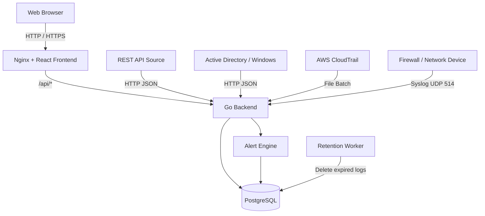

# Demo Log Management System

A multi-source Log Management System built with React, Go, PostgreSQL, and Docker.

The system collects logs from multiple sources, normalizes them into a common schema, stores them in PostgreSQL, and provides log search, dashboards, alerts, authentication, role-based access control, tenant isolation, and automatic log retention.

The project supports two deployment modes:

- **Appliance** — single machine or VM using Docker Compose
- **SaaS** — Google Cloud deployment with HTTPS

---

# Features

## Log Sources

The system currently supports four ingestible demo sources:

| Source | Ingestion Method |
|---|---|
| REST API | HTTP JSON |
| Firewall / Network Device | Syslog UDP |
| Active Directory / Windows Security | HTTP JSON |
| AWS CloudTrail | File Batch Upload |

Supported ingestion methods:

```text
HTTP JSON
Syslog UDP
File Batch Upload
```

---

## Log Management

The system provides:

- Centralized normalized log storage
- PostgreSQL persistence
- Text search
- Tenant filtering
- Source filtering
- Event type filtering
- User filtering
- Time-range filtering

---

## Dashboard

The dashboard provides:

- Total Logs
- Log Timeline
- Top Source IPs
- Top Users
- Top Event Types
- Tenant filtering

---

## Alerts

Current demo alert rule:

**Repeated Failed Login**

An alert is generated when at least three failed login events from the same source IP are detected within five minutes.

Example failed-login event types:

```text
app_login_failed
LogonFailed
```

Generated alerts are stored in PostgreSQL and displayed on the Alerts page.

---

## Authentication and RBAC

The system supports two roles:

```text
Admin
Viewer
```

Admin users can view data from multiple tenants.

Viewer users are restricted to their assigned tenant.

Authentication uses JWT tokens and passwords are stored as bcrypt hashes.

---

## Tenant Isolation

Tenant isolation is enforced by the backend.

For example:

```text
viewerA
tenant = demoA
```

Even if the Viewer manually sends:

```text
GET /logs?tenant=demoB
```

the backend still applies:

```text
tenant = demoA
```

The frontend also hides the tenant selector for Viewer accounts.

Detailed documentation:

- [Tenant Isolation](docs/tenant-isolation.md)

---

## Log Retention

The backend contains an automatic log retention worker.

Default configuration:

```env
LOG_RETENTION_DAYS=7
RETENTION_CHECK_INTERVAL_MINUTES=60
```

Logs older than the configured retention period are automatically removed.

The retention worker:

```text
runs immediately when the backend starts
+
runs again at the configured interval
```

Retention was also verified on the cloud deployment by inserting an expired log and confirming that the worker removed it from PostgreSQL.

---

# Architecture



More details:

- [System Architecture](docs/architecture.md)
- [Data Flow](docs/data-flow.md)
- [Tenant Isolation](docs/tenant-isolation.md)

---

# Tech Stack

## Frontend

- React
- TypeScript
- Ant Design
- Recharts
- Axios
- Vite

## Backend

- Go
- Gin
- GORM

## Database

- PostgreSQL

## Deployment

- Docker
- Docker Compose
- Nginx
- Google Compute Engine
- Let's Encrypt
- Certbot

---

# Project Structure

```text
log-management-demo/
│
├── backend/
│   ├── config/
│   ├── controllers/
│   ├── entity/
│   ├── ingest/
│   ├── middleware/
│   ├── routers/
│   ├── services/
│   ├── tests/
│   ├── .env.example
│   ├── Dockerfile
│   ├── go.mod
│   ├── go.sum
│   └── main.go
│
├── frontend/
│   ├── public/
│   ├── src/
│   │   ├── api/
│   │   ├── component/
│   │   ├── contexts/
│   │   ├── pages/
│   │   └── types/
│   ├── Dockerfile
│   ├── nginx.conf
│   ├── package.json
│   └── vite.config.ts
│
├── docs/
│   ├── architecture.md
│   ├── data-flow.md
│   ├── tenant-isolation.md
│   ├── setup_appliance.md
│   └── setup_saas.md
│
├── samples/
│   └── aws_cloudtrail.json
│
├── .env.example
├── docker-compose.yml
└── README.md
```

---

# Documentation

- [System Architecture](docs/architecture.md)
- [Data Flow](docs/data-flow.md)
- [Tenant Isolation](docs/tenant-isolation.md)
- [Appliance Deployment Guide](docs/setup_appliance.md)
- [SaaS Deployment Guide](docs/setup_saas.md)

---

# Normalized Log Schema

Logs from different sources are converted into a common schema.

Main fields include:

```text
@timestamp
tenant
source
vendor
product
event_type
event_id
logon_type
severity
action
src_ip
src_port
dst_ip
dst_port
protocol
cloud_account_id
cloud_region
cloud_service
user
host
reason
raw
created_at
```

Different log sources populate different subsets of these fields.

Examples:

```text
Firewall
→ source/destination IP
→ source/destination port
→ protocol
→ action

Active Directory
→ event ID
→ event type
→ user
→ host
→ logon type

AWS CloudTrail
→ cloud account
→ cloud region
→ cloud service
→ event type
→ user

REST API
→ generic application event information
```

---

# API Overview

When accessed through Nginx, the public HTTP endpoints use the `/api` prefix.

## Public Endpoints

```http
GET  /api/health
POST /api/auth/login

POST /api/ingest
POST /api/ingest/ad
POST /api/ingest/aws-file
```

The ingestion endpoints are intentionally simple for this demo and currently do not require an ingestion API key.

---

## Protected Endpoints

The following endpoints require authentication:

```http
GET /api/logs
GET /api/dashboard
GET /api/alerts
```

Header:

```http
Authorization: Bearer <JWT_TOKEN>
```

---

# REST API Ingestion

Example:

```json
{
  "tenant": "demoA",
  "source": "api",
  "event_type": "app_login_failed",
  "user": "alice",
  "ip": "203.0.113.7",
  "reason": "wrong_password"
}
```

Endpoint:

```http
POST /api/ingest
```

The backend normalizes:

```text
ip
```

into:

```text
src_ip
```

before storage.

---

# Active Directory Ingestion

Example:

```json
{
  "tenant": "demoA",
  "source": "ad",
  "event_id": 4625,
  "event_type": "LogonFailed",
  "user": "demo\\eve",
  "host": "DC01",
  "ip": "203.0.113.77",
  "logon_type": 3
}
```

Endpoint:

```http
POST /api/ingest/ad
```

---

# AWS CloudTrail File Batch

Sample file:

```text
samples/aws_cloudtrail.json
```

Endpoint:

```http
POST /api/ingest/aws-file
```

Example:

```bash
curl -X POST http://localhost/api/ingest/aws-file \
  -F "file=@samples/aws_cloudtrail.json"
```

The backend accepts AWS JSON file data, normalizes the events, and stores them in PostgreSQL.

---

# Syslog Ingestion

External Syslog port:

```text
UDP 514
```

Internal Go listener:

```text
UDP 5514
```

Docker mapping:

```text
Host UDP 514
      |
      v
Backend UDP 5514
```

Example Syslog message:

```text
vendor=demo product=ngfw action=deny src=10.0.1.10 dst=8.8.8.8 spt=5353 dpt=53 proto=udp
```

The Syslog parser extracts fields such as:

```text
vendor
product
action
src_ip
dst_ip
src_port
dst_port
protocol
```

---

# Demo Tenants

The demo currently uses:

```text
demoA
demoB
```

Example distribution:

```text
demoA
├── REST API
├── Firewall
└── Active Directory

demoB
└── AWS CloudTrail
```

---

# Demo Accounts

Demo account configuration is controlled using environment variables.

Example:

```env
ADMIN_USERNAME=admin
ADMIN_PASSWORD=change-this-password

VIEWER_USERNAME=viewerA
VIEWER_PASSWORD=change-this-password
```

Example values are available in:

```text
backend/.env.example
```

The live SaaS credentials are not stored in the public repository.

Credentials can be provided separately to the evaluator when required.

---

# Environment Variables

## Root Environment

Create:

```text
.env
```

Example:

```env
POSTGRES_PASSWORD=change-this-password
```

## Backend Environment

Create:

```text
backend/.env
```

Example:

```env
DB_HOST=db
DB_PORT=5432
DB_USER=postgres
DB_PASSWORD=change-this-password
DB_NAME=log_management

JWT_SECRET=change-this-to-a-long-random-secret

ADMIN_USERNAME=admin
ADMIN_PASSWORD=change-this-admin-password

VIEWER_USERNAME=viewerA
VIEWER_PASSWORD=change-this-viewer-password

LOG_RETENTION_DAYS=7
RETENTION_CHECK_INTERVAL_MINUTES=60
```

Real `.env` files and production secrets must not be committed to Git.

---

# Appliance Deployment

The complete application can run on a single machine or virtual machine using Docker Compose.

Recommended environment:

```text
Ubuntu Server 22.04+
4 vCPU
8 GB RAM
40 GB disk
Docker Engine
Docker Compose
```

Services:

```text
frontend
backend
db
```

Start from the project root:

```bash
docker compose up -d --build
```

Check:

```bash
docker compose ps
```

Local web application:

```text
http://localhost
```

Health endpoint:

```text
http://localhost/api/health
```

Expected response:

```json
{
  "status": "ok"
}
```

Detailed instructions:

- [Appliance Deployment Guide](docs/setup_appliance.md)

---

# SaaS Deployment

The project has also been deployed on Google Cloud Compute Engine.

Current environment:

```text
Cloud Provider: Google Cloud
Service: Compute Engine
Region: asia-southeast1
Operating System: Ubuntu 22.04 LTS
vCPU: 4
Memory: 8 GB
Disk: 40 GB
Deployment: Docker Compose
```

Static public IPv4:

```text
35.247.183.116
```

Public SaaS URL while the VM is running:

```text
https://35.247.183.116
```

Public entry points:

| Port | Protocol | Purpose |
|---|---|---|
| 80 | TCP | HTTP redirect / ACME challenge |
| 443 | TCP | HTTPS Web UI and API |
| 514 | UDP | Syslog ingestion |

HTTP requests are redirected to HTTPS.

HTTPS is terminated by Nginx using a Let's Encrypt certificate managed by Certbot.

Cloud flow:

```text
Internet
   |
   | HTTPS 443
   v
Google Cloud VM
   |
   v
Nginx
   |
   | /api/*
   v
Go Backend
   |
   v
PostgreSQL
```

Detailed instructions:

- [SaaS Deployment Guide](docs/setup_saas.md)

---

# Testing

Backend tests include both unit and integration tests.

Directory:

```text
backend/
```

Run:

```bash
go test ./... -v -count=1
```

Current normalization tests include:

```text
TestNormalizeAWSLog
TestNormalizeLogMapsFields
TestNormalizeLogParsesTimestamp
TestNormalizeLogUsesCurrentTimeWhenTimestampMissing
```

Current integration tests include:

```text
TestHealthEndpoint
TestAdminLogin
TestViewerTenantIsolation
```

The tenant isolation test verifies that a Viewer cannot access another tenant by manually changing query parameters.

---

# Retention Verification

Cloud retention verification was performed by:

```text
1. Creating a log older than the seven-day retention period
2. Confirming that the ingestion API accepted the event
3. Allowing the retention worker to run
4. Confirming that one expired log was deleted
5. Querying PostgreSQL
6. Confirming that the expired log no longer existed
```

---

# Security

Implemented security controls include:

- HTTPS / TLS on the SaaS deployment
- JWT authentication
- bcrypt password hashing
- Admin / Viewer RBAC
- Backend tenant isolation
- Google Cloud firewall rules
- PostgreSQL not directly exposed publicly
- Environment secrets excluded from Git
- Strong credentials for the live SaaS environment

The project is a demonstration system.

Additional production hardening should include:

- Login rate limiting
- Authentication or API keys for ingestion endpoints
- Cloud secret management
- More restrictive Syslog source ranges
- Database least-privilege users
- Audit logging

---

# Verification Status

## Log Sources

- [x] REST API
- [x] Firewall / Syslog
- [x] Active Directory
- [x] AWS CloudTrail

## Ingestion

- [x] HTTP JSON
- [x] Syslog UDP
- [x] File Batch

## Log Management

- [x] Normalized schema
- [x] PostgreSQL storage
- [x] Search
- [x] Tenant filter
- [x] Source filter
- [x] Event type filter
- [x] User filter
- [x] Time filter

## Dashboard

- [x] Total Logs
- [x] Timeline
- [x] Top IP
- [x] Top Users
- [x] Top Event Types

## Alerts

- [x] Repeated failed login rule
- [x] Alert storage
- [x] Alerts UI

## Security

- [x] Login
- [x] JWT
- [x] bcrypt password hashing
- [x] Admin role
- [x] Viewer role
- [x] Tenant isolation
- [x] HTTPS

## Retention

- [x] Configurable retention worker
- [x] Default 7-day retention
- [x] Cloud retention verification

## Testing

- [x] Unit tests
- [x] Integration tests
- [x] Tenant isolation integration test

## Deployment

- [x] Backend Dockerfile
- [x] Frontend Dockerfile
- [x] Nginx
- [x] Docker Compose
- [x] PostgreSQL volume
- [x] Appliance deployment
- [x] Google Cloud SaaS deployment
- [x] Static public IP
- [x] HTTPS public URL

---

# Future Improvements

Possible improvements include:

- Login rate limiting
- Ingestion API authentication
- GeoIP enrichment
- Additional alert rules
- Webhook notifications
- Email notifications
- Database indexing optimization
- CI/CD pipeline
- Infrastructure as Code
- Kubernetes deployment
- Advanced audit logging
- Improved dashboard visualizations