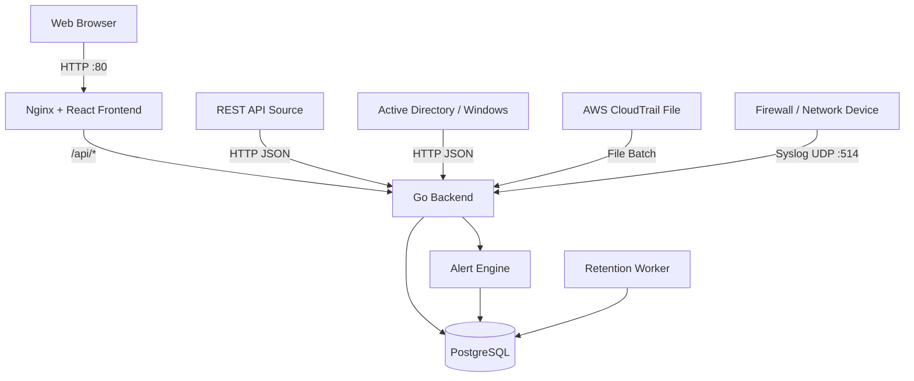

# Demo Log Management System

A demo multi-source Log Management System built with React, Go, PostgreSQL, and Docker.

The system collects logs from multiple sources, normalizes them into a common schema, stores them in PostgreSQL, and provides log search, dashboards, alerts, authentication, role-based access control, tenant isolation, and log retention.

---

## Features

### Log Ingestion

The system currently supports four demo log sources:

- REST API
- Firewall / Network Device
- Active Directory / Windows Security
- AWS CloudTrail

Supported ingestion methods:

- HTTP JSON
- Syslog UDP
- File Batch Upload

### Log Management

- Centralized normalized log storage
- Search and filtering
- Filter by tenant
- Filter by source
- Filter by event type
- Filter by user
- Filter by time range
- Text search

### Dashboard

The dashboard provides:

- Total Logs
- Log Timeline
- Top Source IPs
- Top Users
- Top Event Types

### Alerts

Current demo alert rule:

**Repeated Failed Login**

An alert is generated when at least three failed login events from the same source IP are detected within five minutes.

### Authentication and RBAC

Supported roles:

- Admin
- Viewer

Admin can view logs from all tenants.

Viewer accounts are restricted to their assigned tenant.

### Tenant Isolation

Tenant isolation is enforced by the backend.

For example:

```text
viewerA
tenant = demoA
```

Even if the user manually requests:

```text
GET /logs?tenant=demoB
```

the backend forces the query to use:

```text
tenant = demoA
```

The frontend also hides the tenant selector for Viewer accounts.

### Retention

The system includes automatic log retention.

Default retention period:

```text
7 days
```

The retention period can be configured using:

```text
LOG_RETENTION_DAYS
```

---

# Architecture



Additional documentation:

- [System Architecture](docs/architecture.md)
- [Data Flow](docs/data-flow.md)
- [Tenant Isolation](docs/tenant-isolation.md)

---

# Tech Stack

## Frontend

- React
- TypeScript
- Ant Design
- Recharts
- Axios
- Vite

## Backend

- Go
- Gin
- GORM

## Database

- PostgreSQL

## Deployment

- Docker
- Docker Compose
- Nginx

---

# Project Structure

```text
log-management-demo/
│
├── backend/
│   ├── config/
│   ├── controllers/
│   ├── entity/
│   ├── ingest/
│   ├── middleware/
│   ├── routers/
│   ├── services/
│   ├── tests/
│   │
│   ├── .env
│   ├── Dockerfile
│   ├── go.mod
│   ├── go.sum
│   └── main.go
│
├── frontend/
│   ├── public/
│   ├── src/
│   │   ├── api/
│   │   ├── component/
│   │   │   ├── auth/
│   │   │   ├── dashboard/
│   │   │   └── logs/
│   │   ├── contexts/
│   │   ├── pages/
│   │   └── types/
│   │
│   ├── Dockerfile
│   ├── nginx.conf
│   ├── package.json
│   └── vite.config.ts
│
├── docs/
│   ├── architecture.md
│   ├── data-flow.md
│   └── tenant-isolation.md
│
├── samples/
│   └── aws_cloudtrail.json
│
├── .env
├── docker-compose.yml
└── README.md
```

---

# Normalized Log Schema

Logs from different sources are converted into a common schema.

Main fields include:

```text
@timestamp
tenant
source
vendor
product
event_type
event_id
severity
action
src_ip
src_port
dst_ip
dst_port
protocol
user
host
reason
cloud_account_id
cloud_region
cloud_service
raw
```

Not every source provides every field.

For example:

- Firewall logs normally provide network fields such as source and destination IP.
- AWS CloudTrail logs normally provide cloud account, region, and service fields.
- Active Directory logs provide Event ID, username, host, and logon information.

---

# API Endpoints

## Public Endpoints

### Health Check

```http
GET /health
```

Example response:

```json
{
  "status": "ok"
}
```

### Login

```http
POST /auth/login
```

Example request:

```json
{
  "username": "admin",
  "password": "admin123"
}
```

### Generic REST Log Ingestion

```http
POST /ingest
```

Example:

```json
{
  "tenant": "demoA",
  "source": "api",
  "event_type": "app_login_failed",
  "user": "alice",
  "ip": "203.0.113.7",
  "reason": "wrong_password"
}
```

### Active Directory Log Ingestion

```http
POST /ingest/ad
```

Example:

```json
{
  "tenant": "demoA",
  "source": "ad",
  "event_id": 4625,
  "event_type": "LogonFailed",
  "user": "demo\\eve",
  "host": "DC01",
  "ip": "203.0.113.77",
  "logon_type": 3
}
```

### AWS CloudTrail File Upload

```http
POST /ingest/aws-file
```

Content type:

```text
multipart/form-data
```

Form field:

```text
file
```

A sample file is available at:

```text
samples/aws_cloudtrail.json
```

---

## Protected Endpoints

These endpoints require:

```http
Authorization: Bearer <JWT_TOKEN>
```

### Search Logs

```http
GET /logs
```

Supported query parameters include:

```text
tenant
source
event_type
user
search
from
to
```

Example:

```http
GET /logs?tenant=demoA&source=api
```

### Dashboard

```http
GET /dashboard
```

Supported filters include:

```text
tenant
source
from
to
```

### Alerts

```http
GET /alerts
```

Viewer users only receive alerts belonging to their assigned tenant.

---

# Syslog Ingestion

The Go backend listens internally on:

```text
UDP 5514
```

Docker maps the external standard Syslog port:

```text
UDP 514
```

to:

```text
UDP 5514
```

Flow:

```text
Firewall
   |
   | UDP 514
   v
Docker Host
   |
   | UDP 5514
   v
Go Syslog Listener
   |
   v
PostgreSQL
```

Example test message:

```text
vendor=demo product=ngfw action=deny src=10.0.1.10 dst=8.8.8.8 spt=5353 dpt=53 proto=udp
```

---

# Demo Tenants

The demo currently uses two tenants:

```text
demoA
demoB
```

Example data distribution:

```text
demoA
├── REST API
├── Firewall
└── Active Directory

demoB
└── AWS CloudTrail
```

---

# Demo Accounts

## Admin

```text
Username: admin
Password: admin123
```

Admin can view all tenants.

## Viewer

```text
Username: viewerA
Password: viewer123
Tenant: demoA
```

Viewer can only access logs belonging to `demoA`.

> These credentials are for demonstration only and should be changed before production deployment.

---

# Environment Variables

## Backend

The backend uses environment variables such as:

```env
DB_HOST=localhost
DB_PORT=5432
DB_USER=postgres
DB_PASSWORD=your-password
DB_NAME=log_management

JWT_SECRET=change-this-secret

ADMIN_USERNAME=admin
ADMIN_PASSWORD=admin123

VIEWER_USERNAME=viewerA
VIEWER_PASSWORD=viewer123

LOG_RETENTION_DAYS=7
RETENTION_CHECK_INTERVAL_MINUTES=60
```

When running locally, these values can be loaded from:

```text
backend/.env
```

When running with Docker Compose, environment variables are passed into the backend container.

---

# Docker Deployment

## Requirements

Install:

- Docker Desktop
- Docker Compose
- WSL 2 on Windows

Verify:

```bash
docker --version
```

and:

```bash
docker compose version
```

---

## Start the System

Run from the project root:

```bash
docker compose up -d
```

The system starts three services:

```text
db
backend
frontend
```

Check status:

```bash
docker compose ps
```

Expected services:

```text
log-management-db
log-management-backend
log-management-frontend
```

---

## Open the Web Application

Open:

```text
http://localhost
```

---

## Health Check

Open:

```text
http://localhost/api/health
```

Expected response:

```json
{
  "status": "ok"
}
```

---

## View Docker Logs

All services:

```bash
docker compose logs
```

Follow logs:

```bash
docker compose logs -f
```

Backend only:

```bash
docker compose logs backend
```

---

## Stop the System

```bash
docker compose down
```

This stops the containers but keeps the PostgreSQL volume.

---

## Remove Containers and Database Volume

```bash
docker compose down -v
```

> Warning: this removes the PostgreSQL Docker volume and deletes the database stored inside it.

---

# Docker Services

## Frontend

The frontend is built using Node.js and served by Nginx.

Production flow:

```text
React + TypeScript
        |
        | npm run build
        v
      dist/
        |
        v
      Nginx
```

Nginx serves the frontend on:

```text
Port 80
```

Nginx also acts as a reverse proxy.

Requests to:

```text
/api/*
```

are forwarded to the backend.

Example:

```text
Browser
GET /api/dashboard

        |
        v

Nginx

        |
        v

Backend
GET /dashboard
```

---

## Backend

The backend container runs the compiled Go application.

Ports:

```text
8080 TCP
5514 UDP
```

---

## PostgreSQL

PostgreSQL runs inside a separate Docker container.

The database is stored using a Docker volume:

```text
postgres_data
```

This allows database data to survive container recreation.

---

# Local Development

The application can also run without Docker.

## Backend

Directory:

```text
backend/
```

Run:

```bash
go run .
```

Backend:

```text
http://localhost:8080
```

---

## Frontend

Directory:

```text
frontend/
```

Install dependencies:

```bash
npm install
```

Run:

```bash
npm run dev
```

Frontend:

```text
http://localhost:5173
```

During local development, the frontend communicates directly with:

```text
http://localhost:8080
```

---

# Testing

The backend contains both Unit Tests and Integration Tests.

Run all tests:

```bash
go test ./... -v
```

Force Go to run tests again without using cached results:

```bash
go test ./... -v -count=1
```

---

## Unit Tests

Current normalization tests include:

```text
TestNormalizeAWSLog
TestNormalizeLogMapsFields
TestNormalizeLogParsesTimestamp
TestNormalizeLogUsesCurrentTimeWhenTimestampMissing
```

These tests verify:

- API log normalization
- AWS CloudTrail normalization
- IP to `src_ip` mapping
- timestamp parsing
- default timestamp behavior
- AWS cloud metadata mapping

---

## Integration Tests

Current integration tests include:

```text
TestHealthEndpoint
TestAdminLogin
TestViewerTenantIsolation
```

### Health Test

Verifies that:

```http
GET /api/health
```

returns:

```json
{
  "status": "ok"
}
```

### Admin Login Test

Verifies that the Admin user can authenticate and receive a JWT token.

### Tenant Isolation Test

The test logs in as:

```text
viewerA
```

which belongs to:

```text
demoA
```

The test intentionally requests:

```text
GET /logs?tenant=demoB
```

The test passes only if every returned log still belongs to:

```text
demoA
```

This verifies that tenant isolation cannot be bypassed by modifying query parameters.

---

# Alert Rule

Current rule:

```text
Repeated Failed Login
```

Conditions:

```text
Failed login events
+
Same source IP
+
At least 3 events
+
Within 5 minutes
```

Example event types:

```text
app_login_failed
LogonFailed
```

When the threshold is reached, an alert is stored in PostgreSQL and displayed on the Alerts page.

Duplicate alerts from the same event window are prevented.

---

# Log Retention

The backend contains a retention worker.

Default configuration:

```env
LOG_RETENTION_DAYS=7
RETENTION_CHECK_INTERVAL_MINUTES=60
```

The worker removes logs where:

```text
timestamp < current time - retention period
```

The cleanup process runs when the backend starts and continues at the configured interval.

---

# Appliance Deployment

The current Docker Compose configuration can run the complete system on a single machine or virtual machine.

Example target:

```text
Ubuntu Server
Docker
Docker Compose
```

Services:

```text
Frontend / Nginx
Go Backend
PostgreSQL
```

External ports:

| Port | Protocol | Purpose |
|---|---|---|
| 80 | TCP | Web application |
| 8080 | TCP | Backend API |
| 514 | UDP | Syslog ingestion |

PostgreSQL remains inside the Docker network and does not need to be exposed publicly.

---

# Current Deployment Status

## Appliance

Implemented and tested locally using Docker Compose.

Working endpoints:

```text
http://localhost
http://localhost/api/health
```

Frontend, backend, and PostgreSQL containers are running successfully.

## SaaS / Cloud

Public cloud deployment with an external HTTPS URL is not yet configured.

This is planned as a separate deployment step.

---

# Security Notes

This project is a demonstration system.

Implemented security features include:

- JWT authentication
- Role-based access control
- Backend tenant isolation
- Password hashing
- Protected log/dashboard/alert APIs

For a production system, additional security should be added, such as:

- HTTPS/TLS
- API keys or authentication for ingestion endpoints
- Secret management
- Rate limiting
- Strong production passwords
- Network firewall rules
- Database least-privilege users
- Audit logging

---

# Verification Checklist

## Log Sources

- [x] REST API
- [x] Firewall / Syslog
- [x] Active Directory
- [x] AWS CloudTrail

## Ingestion

- [x] HTTP JSON
- [x] Syslog UDP
- [x] File Batch

## Log Management

- [x] PostgreSQL storage
- [x] Normalized schema
- [x] Search
- [x] Tenant filter
- [x] Source filter
- [x] Event type filter
- [x] Time range filter

## Dashboard

- [x] Total Logs
- [x] Timeline
- [x] Top IP
- [x] Top Users
- [x] Top Event Types

## Security

- [x] Login
- [x] JWT
- [x] Admin role
- [x] Viewer role
- [x] Tenant isolation

## Alerts

- [x] Repeated failed login rule
- [x] Alert storage
- [x] Alert page

## Retention

- [x] Configurable retention worker
- [x] Default 7-day retention

## Testing

- [x] Unit tests
- [x] Integration tests
- [x] Tenant isolation test

## Deployment

- [x] Backend Dockerfile
- [x] Frontend Dockerfile
- [x] Nginx
- [x] Docker Compose
- [x] PostgreSQL volume
- [x] Appliance deployment
- [ ] Public SaaS deployment
- [ ] HTTPS public URL

---

# Documentation

Detailed documentation is available in:

```text
docs/
├── architecture.md
├── data-flow.md
└── tenant-isolation.md
```

---

# Future Improvements

Possible improvements include:

- HTTPS public SaaS deployment
- GeoIP enrichment
- Additional alert rules
- Webhook notifications
- Email notifications
- Additional log sources
- API key authentication for ingestion
- Database indexing optimization
- CI/CD pipeline
- Kubernetes deployment
- Infrastructure as Code
- Advanced audit logging
- Improved dashboard visualizations