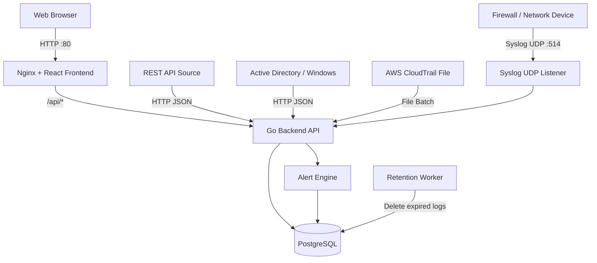
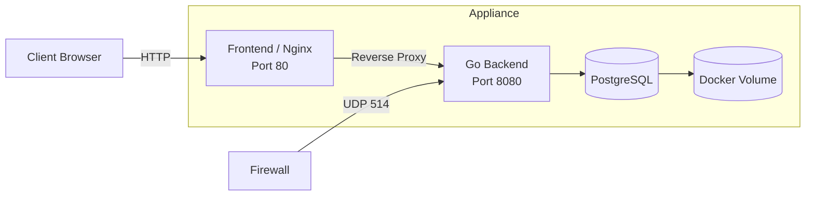

# System Architecture

## Overview

The Demo Log Management System is designed to collect logs from multiple sources, normalize them into a common schema, store them in PostgreSQL, and provide searching, dashboards, alerts, authentication, and tenant isolation.

The system supports an Appliance deployment using Docker Compose on a single machine or virtual machine.

## Architecture



## Main Components

### Frontend

Technology:

- React
- TypeScript
- Ant Design
- Recharts
- Axios

Responsibilities:

- Login
- Dashboard
- Log search and filtering
- Alert viewing
- Role-aware user interface

In production, the React application is built into static files and served by Nginx.

### Nginx

Nginx serves the frontend and acts as a reverse proxy.

Requests to:

```text
/
```

are handled by the React frontend.

Requests to:

```text
/api/*
```

are forwarded to the Go backend.

Example:

```text
GET /api/dashboard
```

is forwarded internally to:

```text
GET backend:8080/dashboard
```

### Backend

Technology:

- Go
- Gin
- GORM

Responsibilities:

- Authentication
- JWT validation
- Tenant isolation
- Log ingestion
- Log normalization
- Search and filtering
- Dashboard aggregation
- Alert detection
- Retention management

### PostgreSQL

PostgreSQL stores:

- normalized logs
- alerts
- users

The database is stored in a Docker volume so that data remains available even when containers are recreated.

### Docker Compose

Docker Compose manages the three main services:

```text
frontend
backend
db
```

The services communicate through an internal Docker network.

## Deployment Architecture



## Ports

| Port | Protocol | Purpose |
|---|---|---|
| 80 | TCP | Web UI and reverse proxy |
| 8080 | TCP | Backend API |
| 514 | UDP | External Syslog ingestion |
| 5514 | UDP | Internal backend Syslog listener |
| 5432 | TCP | PostgreSQL inside Docker network |

PostgreSQL port 5432 is not exposed publicly by the Docker Compose configuration.