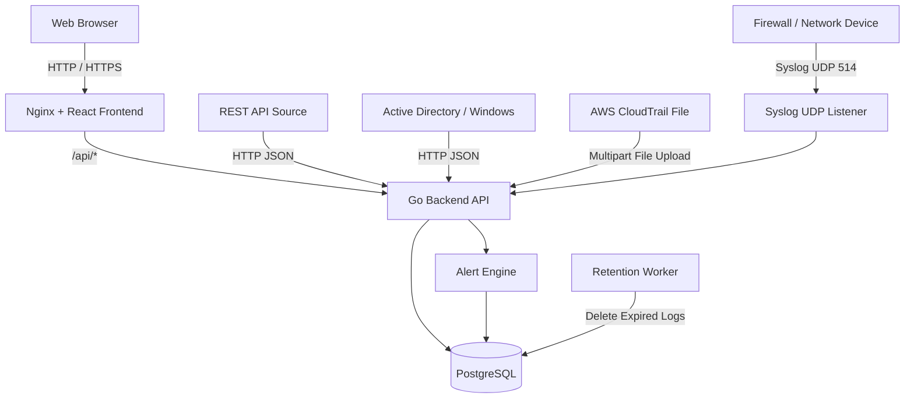
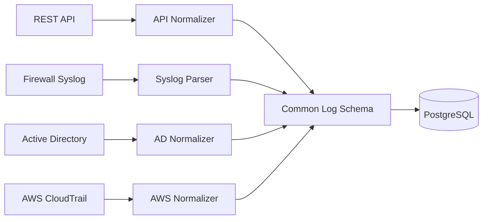
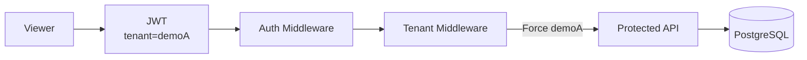
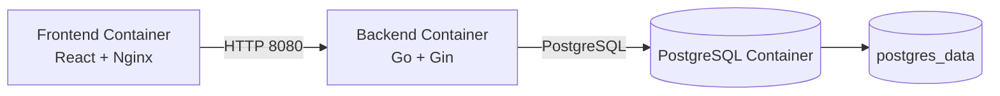
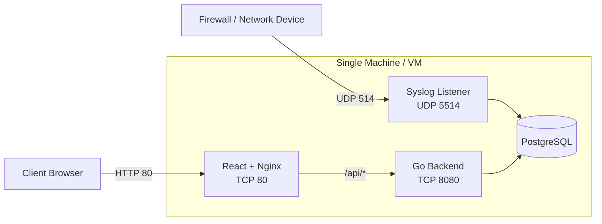
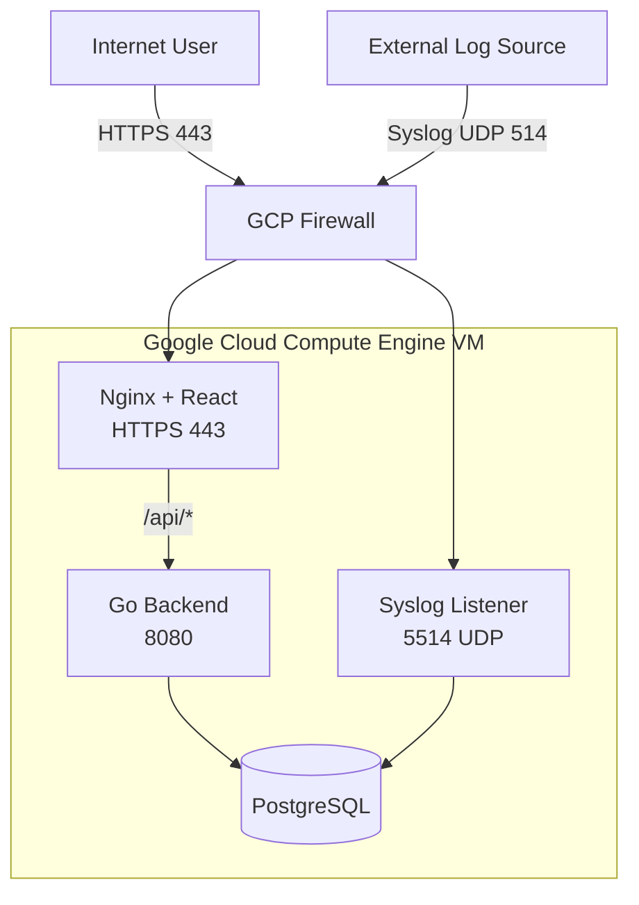
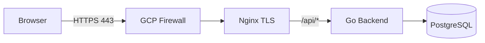
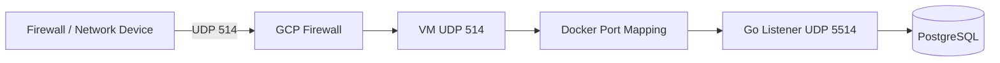
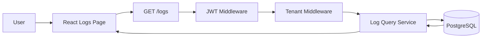
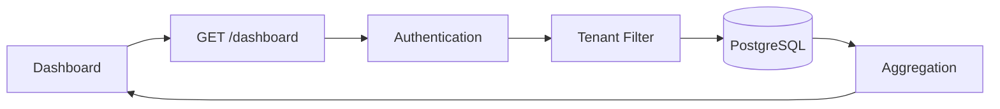

# System Architecture

## Overview

The Demo Log Management System collects logs from multiple sources,
normalizes them into a common schema, stores them in PostgreSQL,
and provides search, dashboards, alerts, authentication,
role-based access control, tenant isolation, and automatic log retention.

The system supports two deployment modes:

1. **Appliance** - Docker Compose on a single machine or virtual machine
2. **SaaS** - Google Cloud deployment accessible through HTTPS

---

# High-Level Architecture



---

# Main Components

## Frontend

Technology:

- React
- TypeScript
- Ant Design
- Recharts
- Axios
- Vite

Responsibilities:

- Login
- Dashboard
- Log search and filtering
- Alert viewing
- Role-aware user interface
- Tenant-aware interface

The React application is compiled into static files and served by Nginx.

---

## Nginx

Nginx provides two main functions:

1. Serve the React frontend
2. Reverse proxy API requests to the Go backend

Frontend requests:

```text
/
```

are served by React.

API requests:

```text
/api/*
```

are forwarded internally to:

```text
backend:8080
```

Example:

```text
Browser
   |
   | GET /api/dashboard
   v
Nginx
   |
   | GET /dashboard
   v
Go Backend
```

In the SaaS deployment, Nginx also provides HTTPS termination.

---

## Backend

Technology:

- Go
- Gin
- GORM

Responsibilities:

- Authentication
- JWT creation and validation
- Role-based access control
- Tenant isolation
- Log ingestion
- Log normalization
- Log search and filtering
- Dashboard aggregation
- Alert processing
- Log retention

The backend HTTP service listens on:

```text
TCP 8080
```

---

## Syslog Listener

The Go backend also contains a UDP Syslog listener.

Internal listener:

```text
UDP 5514
```

Docker maps the standard external Syslog port:

```text
UDP 514
```

to:

```text
UDP 5514
```

Flow:

```text
Firewall
   |
   | UDP 514
   v
Docker Host
   |
   | UDP 5514
   v
Go Syslog Listener
```

---

## PostgreSQL

PostgreSQL stores:

- normalized logs
- alerts
- users

The database runs as a separate Docker service.

Persistent data is stored in a Docker volume:

```text
postgres_data
```

This allows database data to remain available after containers
are recreated or restarted.

PostgreSQL is used internally by the backend and is not used
as a public application endpoint.

---

## Alert Engine

The alert engine evaluates normalized logs after ingestion.

Current alert rule:

```text
Repeated Failed Login
```

Conditions:

```text
Same source IP
+
Failed login event
+
At least 3 events
+
Within 5 minutes
```

When the threshold is reached:

```text
Normalized Log
      |
      v
Alert Rule Engine
      |
      v
Create Alert
      |
      v
PostgreSQL
      |
      v
Alerts UI
```

---

## Retention Worker

The backend includes an automatic retention worker.

Default retention:

```text
7 days
```

Configuration:

```env
LOG_RETENTION_DAYS=7
RETENTION_CHECK_INTERVAL_MINUTES=60
```

The worker removes logs where:

```text
timestamp < current UTC time - retention period
```

Cleanup runs:

```text
when the backend starts
+
at the configured interval
```

Retention behavior has also been verified in the cloud deployment
using an expired test log.

---

# Log Sources

The system currently supports four demo sources.

| Source | Ingestion Method |
|---|---|
| REST API | HTTP JSON |
| Firewall / Network Device | Syslog UDP |
| Active Directory / Windows | HTTP JSON |
| AWS CloudTrail | File Batch Upload |

These different formats are normalized into the same internal
log schema before being stored.

---

# Normalization Architecture



Main normalized fields include:

```text
@timestamp
tenant
source
vendor
product
event_type
event_id
severity
action
src_ip
src_port
dst_ip
dst_port
protocol
user
host
reason
cloud_account_id
cloud_region
cloud_service
raw
```

Not every log source provides every field.

---

# Authentication and Tenant Isolation

The system supports two roles:

```text
Admin
Viewer
```

## Admin

Admin users can access multiple tenants.

Example:

```text
Admin
├── demoA
└── demoB
```

## Viewer

Viewer users are restricted to their assigned tenant.

Example:

```text
viewerA
tenant = demoA
```

Tenant isolation is enforced by backend middleware.



Frontend restrictions are used for usability,
while backend enforcement provides the actual tenant security boundary.

---

# Docker Architecture

Docker Compose manages the main services:

```text
frontend
backend
db
```



The services communicate through the Docker network.

---

# Deployment Mode 1: Appliance

The Appliance mode runs the complete system on a single machine
or virtual machine.

Recommended environment:

```text
Ubuntu Server 22.04+
4 vCPU
8 GB RAM
40 GB disk
Docker
Docker Compose
```

Architecture:



The Appliance deployment is managed using:

```text
docker-compose.yml
```

---

# Deployment Mode 2: SaaS

The SaaS deployment is hosted on Google Cloud.

Current environment:

```text
Cloud Provider: Google Cloud
Compute Service: Compute Engine

Region: asia-southeast1
Operating System: Ubuntu 22.04 LTS

vCPU: 4
Memory: 8 GB
Disk: 40 GB
```

The deployment uses Docker Compose on the cloud VM.

Public SaaS URL:

```text
https://35.247.183.116
```

The VM uses a static public IPv4 address.

---

# SaaS Network Architecture



---

# HTTPS Architecture

The SaaS deployment uses HTTPS.

Public flow:

```text
Browser
   |
   | HTTPS 443
   v
Google Cloud VM
   |
   v
Nginx TLS
   |
   | /api/*
   v
Go Backend
```

HTTP requests on port 80 are redirected to HTTPS.

```text
HTTP 80
   |
   v
301 Redirect
   |
   v
HTTPS 443
```

The TLS certificate is provided by:

```text
Let's Encrypt
```

Certificate management is handled using:

```text
Certbot
```

The certificate files are mounted read-only into the Nginx container.

---

# SaaS Public Ports

The intended public entry points are:

| Port | Protocol | Purpose |
|---|---|---|
| 80 | TCP | HTTP redirect and ACME challenge |
| 443 | TCP | HTTPS web application |
| 514 | UDP | Syslog ingestion |

Application users access the backend through:

```text
HTTPS
→ Nginx
→ /api/*
→ Go Backend
```

The backend port `8080` is not intended to be the normal public
application entry point.

PostgreSQL is not exposed as a public service.

---

# SaaS HTTPS Flow



---

# SaaS Syslog Flow



---

# Search Flow



Supported filters include:

```text
tenant
source
event_type
user
search
from
to
```

---

# Dashboard Flow



Dashboard aggregation includes:

- Total Logs
- Timeline
- Top IP
- Top Users
- Top Event Types

---

# Security Architecture

Current security controls include:

- HTTPS / TLS for SaaS
- JWT authentication
- bcrypt password hashing
- Admin and Viewer roles
- Backend tenant isolation
- Google Cloud firewall rules
- Strong SaaS credentials
- PostgreSQL isolated from direct public access
- Secrets stored outside the Git repository

Additional hardening that can be added for production includes:

- Login rate limiting
- API key authentication for ingestion
- Cloud Secret Manager
- More restrictive Syslog source ranges
- Audit logging

---

# Port Summary

## Appliance

| Port | Protocol | Purpose |
|---|---|---|
| 80 | TCP | Web UI / Nginx |
| 8080 | TCP | Backend API |
| 514 | UDP | Syslog ingestion |
| 5514 | UDP | Internal Syslog listener |
| 5432 | TCP | PostgreSQL inside Docker network |

## SaaS

| Port | Protocol | Purpose |
|---|---|---|
| 80 | TCP | HTTP redirect / certificate challenge |
| 443 | TCP | HTTPS Web UI and API |
| 514 | UDP | External Syslog ingestion |
| 8080 | TCP | Backend service behind Nginx |
| 5514 | UDP | Internal Syslog listener |
| 5432 | TCP | PostgreSQL inside Docker network |

---

# Deployment Summary

```text
Appliance
Single Machine / VM
        |
        v
Docker Compose
├── Frontend / Nginx
├── Go Backend
└── PostgreSQL
```

```text
SaaS
Internet
   |
   | HTTPS
   v
Google Cloud VM
   |
   v
Docker Compose
├── Nginx / React
├── Go Backend
└── PostgreSQL
```

Both deployment modes use the same application architecture.

The main difference is that the SaaS deployment adds:

```text
Google Cloud Compute Engine
Static Public IP
Google Cloud Firewall
HTTPS / TLS
Let's Encrypt
Certbot
```