# Data Flow

## Overview

The Demo Log Management System accepts logs from multiple sources
using different ingestion methods.

Supported demo sources:

1. REST API
2. Firewall / Network Device
3. Active Directory / Windows
4. AWS CloudTrail

Supported ingestion methods:

- HTTP JSON
- Syslog UDP
- File Batch Upload

All supported log sources are converted into a common normalized
log schema before being stored in PostgreSQL.

---

# High-Level Data Flow

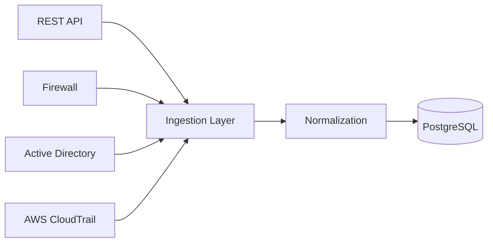

The normalized data can then be used by:

```text
Search
Dashboard
Alert Engine
Retention Worker
```

---

# SaaS Request Flow

The SaaS deployment is hosted on Google Cloud.

Public URL:

```text
https://35.247.183.116
```

Normal web traffic uses HTTPS.

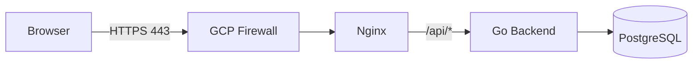

HTTP traffic on port 80 is redirected to HTTPS.

```text
HTTP 80
   |
   v
Nginx
   |
   | 301 Redirect
   v
HTTPS 443
```

Nginx terminates HTTPS and forwards API requests to the backend.

Example:

```text
External request:

GET /api/logs
```

is forwarded internally as:

```text
GET /logs
```

to:

```text
backend:8080
```

---

# REST API Ingestion

External endpoint:

```http
POST /api/ingest
```

The Nginx reverse proxy forwards the request to:

```http
POST /ingest
```

on the backend.

Flow:

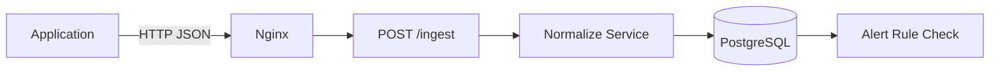

Example input:

```json
{
  "tenant": "demoA",
  "source": "api",
  "event_type": "app_login_failed",
  "user": "alice",
  "ip": "203.0.113.7",
  "reason": "wrong_password"
}
```

The input field:

```text
ip
```

is normalized into:

```text
src_ip
```

The timestamp is taken from:

```text
@timestamp
```

when provided.

If no valid timestamp is provided, the backend uses the current
UTC time.

---

# Firewall Syslog Flow

Firewall and network device logs use Syslog over UDP.

External port:

```text
UDP 514
```

Internal Go listener:

```text
UDP 5514
```

## Appliance

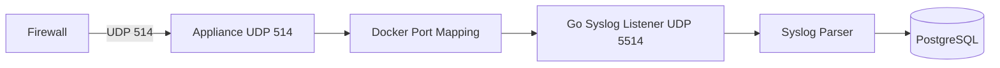

## SaaS

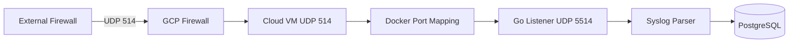

Example Syslog message:

```text
vendor=demo product=ngfw action=deny src=10.0.1.10 dst=8.8.8.8 spt=5353 dpt=53 proto=udp
```

The parser extracts fields including:

```text
vendor
product
action
src_ip
dst_ip
src_port
dst_port
protocol
```

The log is stored with:

```text
tenant = demoA
source = firewall
event_type = firewall_event
```

---

# Active Directory Flow

External endpoint:

```http
POST /api/ingest/ad
```

Backend endpoint:

```http
POST /ingest/ad
```

Flow:

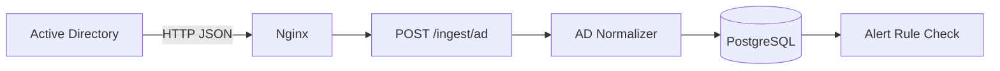

Example event:

```json
{
  "tenant": "demoA",
  "source": "ad",
  "event_id": 4625,
  "event_type": "LogonFailed",
  "user": "demo\\eve",
  "host": "DC01",
  "ip": "203.0.113.77",
  "logon_type": 3
}
```

Example normalized information:

```text
source = ad
event_id = 4625
event_type = LogonFailed
user = demo\eve
src_ip = 203.0.113.77
host = DC01
```

---

# AWS CloudTrail File Batch Flow

External endpoint:

```http
POST /api/ingest/aws-file
```

Backend endpoint:

```http
POST /ingest/aws-file
```

Upload format:

```text
multipart/form-data
```

Flow:

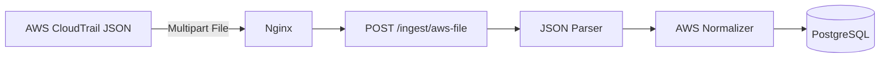

A sample file is available at:

```text
samples/aws_cloudtrail.json
```

The AWS normalizer maps information such as:

```text
cloud_account_id
cloud_region
cloud_service
event_type
user
src_ip
```

into the common log schema.

Both a single AWS record and an array of AWS records can be
processed by the file ingestion endpoint.

---

# Common Normalized Schema

Logs from all sources are stored using the same Log entity.

Main fields include:

```text
@timestamp
tenant
source
vendor
product
event_type
event_id
logon_type
severity
action
src_ip
src_port
dst_ip
dst_port
protocol
cloud_account_id
cloud_region
cloud_service
user
host
reason
raw
created_at
```

Different sources populate different subsets of these fields.

Example:

```text
Firewall
→ network fields

Active Directory
→ Windows event fields

AWS
→ cloud metadata fields

REST API
→ generic application event fields
```

---

# Authentication Flow

Login endpoint:

```http
POST /api/auth/login
```

Flow:

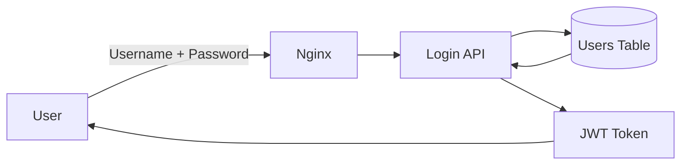

Passwords are verified against bcrypt password hashes stored
in PostgreSQL.

After successful authentication, the backend returns a JWT token.

The frontend sends this token when calling protected APIs.

---

# Protected API Flow

Protected endpoints include:

```text
GET /logs
GET /dashboard
GET /alerts
```

Flow:

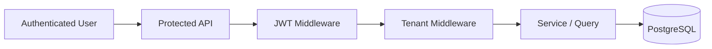

The JWT middleware verifies that the token is valid.

The Tenant middleware then applies tenant restrictions.

---

# Tenant Isolation Flow

Admin users can access multiple tenants.

Viewer users are restricted to the tenant stored in their
authenticated context.

Example:

```text
viewerA
tenant = demoA
```

If Viewer sends:

```http
GET /api/logs?tenant=demoB
```

the backend still applies:

```text
tenant = demoA
```

Flow:

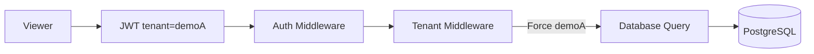

Tenant isolation is enforced by the backend rather than relying
only on the frontend user interface.

---

# Search Flow

External endpoint:

```http
GET /api/logs
```

Flow:

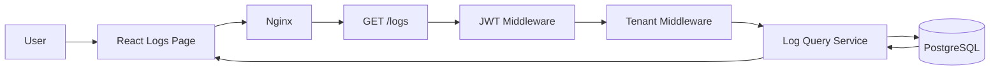

Supported filters include:

```text
tenant
source
event_type
user
search
from
to
```

---

# Dashboard Flow

External endpoint:

```http
GET /api/dashboard
```

Flow:

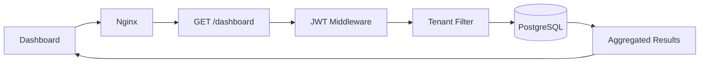

Dashboard aggregation includes:

- Total Logs
- Timeline
- Top Source IPs
- Top Users
- Top Event Types

Admin users can filter across tenants.

Viewer users only receive results for their assigned tenant.

---

# Alert Flow

Current alert rule:

```text
Repeated Failed Login
```

The rule looks for:

```text
failed login event
+
same source IP
+
at least 3 events
+
within 5 minutes
```

Example event types:

```text
app_login_failed
LogonFailed
```

Flow:

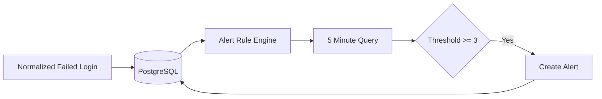

The current REST API and Active Directory ingestion paths invoke
the alert rule check after storing the normalized log.

Generated alerts are displayed through:

```http
GET /api/alerts
```

---

# Retention Flow

Default retention:

```text
7 days
```

Configuration:

```env
LOG_RETENTION_DAYS=7
RETENTION_CHECK_INTERVAL_MINUTES=60
```

Flow:

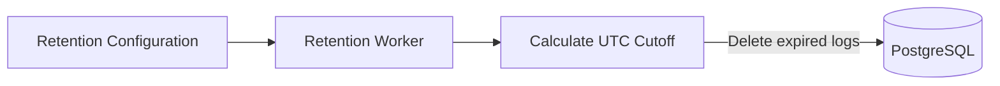

The cutoff is calculated as:

```text
current UTC time - retention days
```

Logs are deleted when:

```text
timestamp < cutoff
```

The cleanup runs immediately when the backend starts and then
continues at the configured interval.

Cloud verification confirmed that an expired test log was
automatically removed from PostgreSQL.

---

# Appliance vs SaaS Flow

The application logic is the same in both deployment modes.

## Appliance

```text
Client
   |
   | HTTP
   v
Single Machine / VM
   |
   v
Docker Compose
├── Frontend / Nginx
├── Backend
└── PostgreSQL
```

## SaaS

```text
Internet
   |
   | HTTPS
   v
Google Cloud
   |
   v
Nginx
   |
   v
Docker Compose
├── Frontend
├── Backend
└── PostgreSQL
```

The SaaS deployment adds:

```text
Google Cloud Compute Engine
Static Public IP
Google Cloud Firewall
HTTPS / TLS
Let's Encrypt certificate
```

The ingestion, normalization, storage, search, alert,
tenant isolation, and retention logic remain the same.