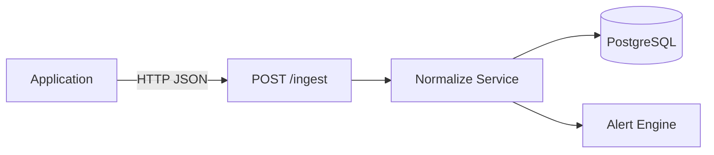
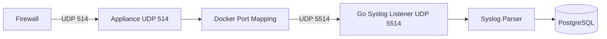
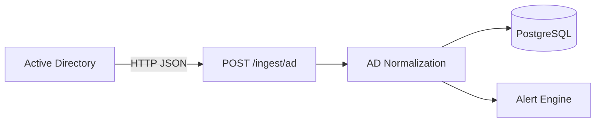
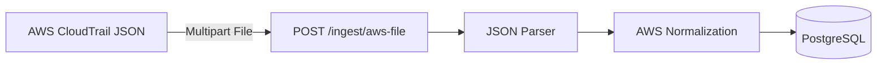
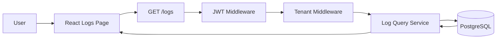
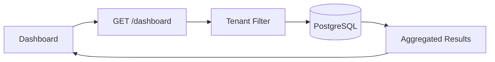
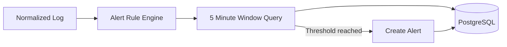
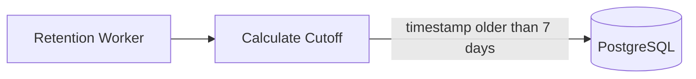

# Data Flow

## Overview

Logs can enter the system through multiple ingestion methods.

Supported demo sources:

1. REST API
2. Firewall / Network Syslog
3. Active Directory / Windows
4. AWS CloudTrail File Batch

The system normalizes different source formats into a common log schema before storing them in PostgreSQL.

---

## REST API Flow



Example input:

```json
{
  "tenant": "demoA",
  "source": "api",
  "event_type": "app_login_failed",
  "user": "alice",
  "ip": "203.0.113.7",
  "reason": "wrong_password"
}
```

The field:

```text
ip
```

is normalized into:

```text
src_ip
```

before storage.

---

## Firewall Syslog Flow



Example Syslog:

```text
vendor=demo product=ngfw action=deny src=10.0.1.10 dst=8.8.8.8 spt=5353 dpt=53 proto=udp
```

The parser extracts fields such as:

```text
vendor
product
action
src_ip
dst_ip
src_port
dst_port
protocol
```

---

## Active Directory Flow



Example event:

```text
Event ID: 4625
Event Type: LogonFailed
```

---

## AWS CloudTrail Flow



The AWS normalizer maps fields such as:

```text
cloud.service
cloud.account_id
cloud.region
event_type
user
```

into the common schema.

---

## Search Flow



Supported filters include:

```text
tenant
source
event_type
user
search
from
to
```

---

## Dashboard Flow



Dashboard aggregation includes:

- Total Logs
- Timeline
- Top IP
- Top Users
- Top Event Types

---

## Alert Flow



Current demo rule:

```text
Repeated Failed Login
```

An alert is generated when at least three failed login events are detected from the same source IP within five minutes.

---

## Retention Flow



Default retention period:

```text
7 days
```

The value can be configured using:

```text
LOG_RETENTION_DAYS
```