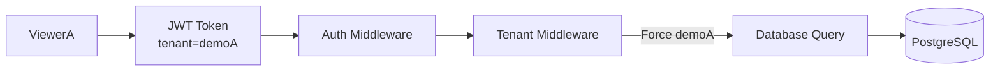

# Tenant Isolation

## Overview

The system provides basic multi-tenant isolation using JWT authentication and backend middleware.

Two demo roles are supported:

```text
Admin
Viewer
```

## Admin

An Admin user is not restricted to one tenant.

Admin can:

- view all tenants
- filter by demoA
- filter by demoB
- view logs from multiple sources

Example:

```text
Admin
├── demoA
└── demoB
```

## Viewer

A Viewer account is assigned to one tenant.

Example:

```text
viewerA
tenant = demoA
```

The backend always forces the viewer to use the tenant stored in the authenticated JWT context.

Even if Viewer sends:

```text
GET /logs?tenant=demoB
```

the backend uses:

```text
tenant = demoA
```

instead.

## Request Flow



## Why Backend Enforcement Is Required

The frontend hides the tenant selector for Viewer accounts.

However, frontend restrictions are only a user interface feature.

A user could manually send:

```text
GET /logs?tenant=demoB
```

using tools such as:

- Postman
- curl
- browser developer tools

Therefore tenant isolation must be enforced by the backend.

The frontend provides usability.

The backend provides security.

## Automated Verification

Tenant isolation is verified by an integration test.

The test logs in as:

```text
viewerA
```

and intentionally requests:

```text
/logs?tenant=demoB
```

The test passes only if every returned log belongs to:

```text
demoA
```

This verifies that tenant isolation cannot be bypassed by changing query parameters.